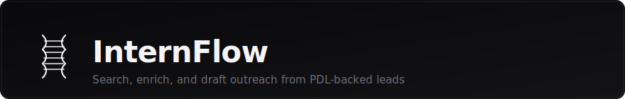
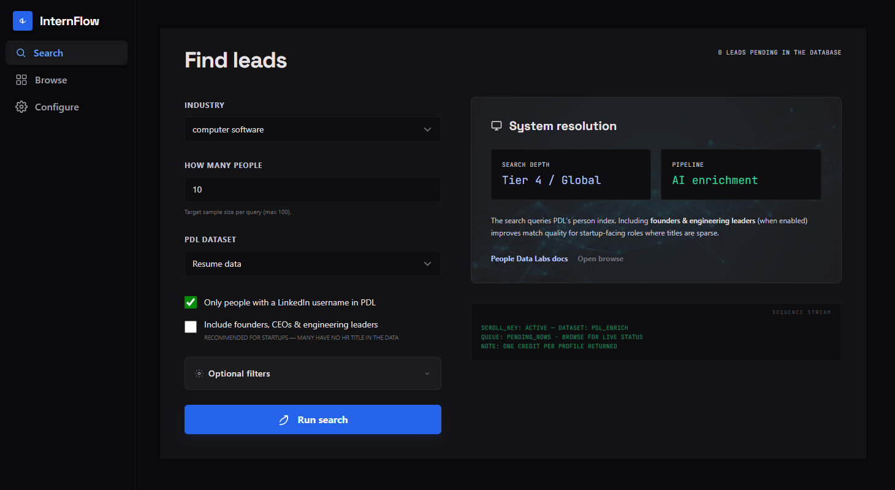
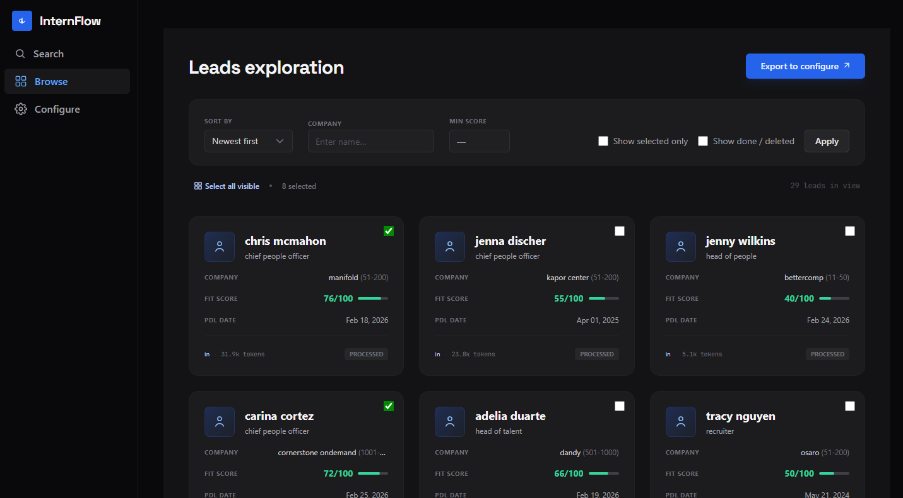
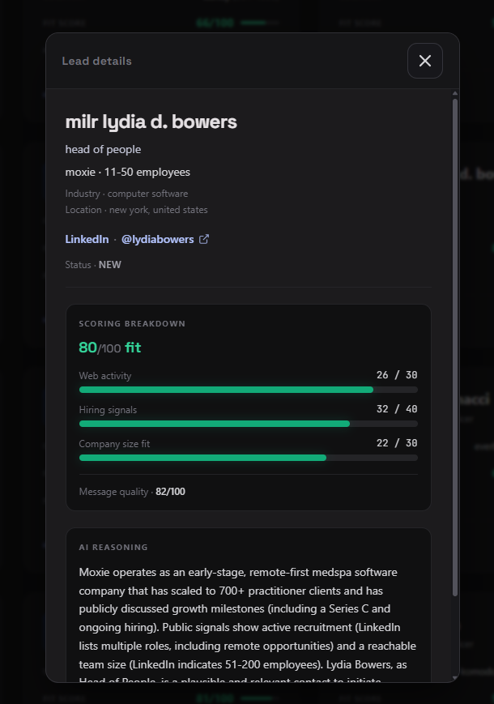
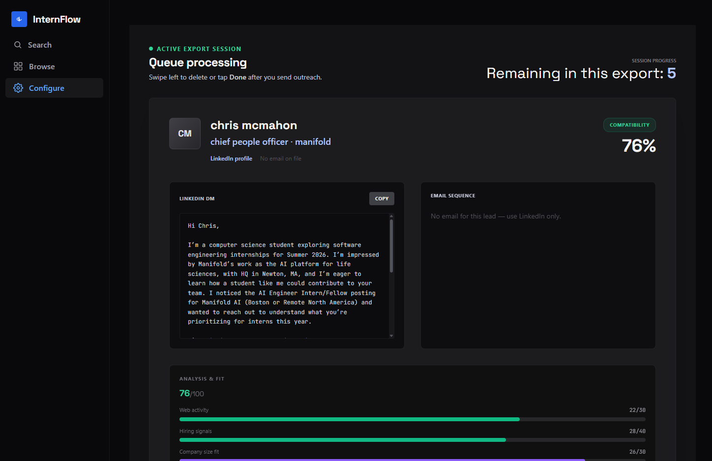

A small **FastAPI** app for running **People Data Labs** person searches, **enriching** matches with AI, and stepping through **LinkedIn and email drafts** before you send anything. Built for teams that care about biotech and life-science outreach but want one place to search, review, and configure copy without wiring five tools together.

---

<p align="center">
  <b>Search → browse → configure</b> in one place.
</p>

<table>
  <tr>
    <td width="50%" valign="top" align="center">
      <b>Search</b><br/>
      <sub>Filters, dataset, run query</sub><br/><br/>
      
    </td>
    <td width="50%" valign="top" align="center">
      <b>Browse</b><br/>
      <sub>Grid, filters, export to configure</sub><br/><br/>
      
    </td>
  </tr>
  <tr>
    <td valign="top" align="center">
      <b>Lead detail</b><br/>
      <sub>Modal on Browse — full profile</sub><br/><br/>
      
    </td>
    <td valign="top" align="center">
      <b>Configure</b><br/>
      <sub>Sender profile, drafts, queue</sub><br/><br/>
      
    </td>
  </tr>
</table>

---

**THIS IS NOT A PRODUCTION PROJECT DEPLOYED TO A WEBSITE AS OF NOW.** To use simply clone and follow the steps indicated below.

---

## When to use it


| You need… | Intern gives you|
| ------------------------------------------------------------------ | ------------------------------------------------------------------------------ |
| Filtered PDL searches with scroll tokens and credit-aware batching | Search UI with industry, location, dataset, and optional company filters       |
| A queue of new leads while AI scores and reasons on each profile   | Browse with filters, selection, and export into a configure session |
| Ready-to-edit outreach tied to your sender name and portfolio link | Configure: one lead at a time, copy buttons, Done / Deleted to clear the queue |

---

## How it flows

1. **Search** — Run a PDL query (size capped, same filters reuse scroll state where applicable). Pending rows land in the database while enrichment runs.
2. **Browse** — Filter, open detail, select leads, **Export to configure**.
3. **Configure** — Enter sender details once, then walk the stack: copy drafts, mark **Done** or swipe/delete, until the export is finished.

---

## Stack

- **Python 3.10+**, **FastAPI**, **Jinja2**, **SQLModel** / SQLite (`config.yaml` points at the DB path)
- **Tailwind CSS** built locally (`npm run build:css`); styles live in `templates/` and ship as `static/css/app.css`
- **OpenAI** (or your configured provider) for scoring and drafts in the enrichment path
- **People Data Labs** API for search and enrichment (API key from environment)

---

## Quick start

```bash
git clone <your-repo-url> internflow
cd internflow
python -m venv .venv
.venv\Scripts\activate          # Windows
# source .venv/bin/activate       # macOS / Linux

pip install -r requirements.txt
```

Set **`PDL_API_KEY`** and **`OPENAI_API_KEY`** (if you use enrichment). The app loads them from the environment ([python-dotenv](https://pypi.org/project/python-dotenv/) reads a `.env` file in the project root if present).

Build CSS once (or whenever templates change):

```bash
npm install
npm run build:css
```

Either run it via python or use your VSCode inbuilt run and debug functionality. 

Default bind: **[http://127.0.0.1:5000](http://127.0.0.1:5000)** (see `main.py`).

---

## Configuration


| File / place         | Role                                                                             |
| -------------------- | -------------------------------------------------------------------------------- |
| `config.yaml`        | SQLite path and DB flags                                                         |
| Environment / `.env` | API keys                                                                         |

---

## Contributing

Issues and PRs welcome. After changing HTML classes under `templates/`, run `npm run build:css` but don't commit your `static/css/app.css`.